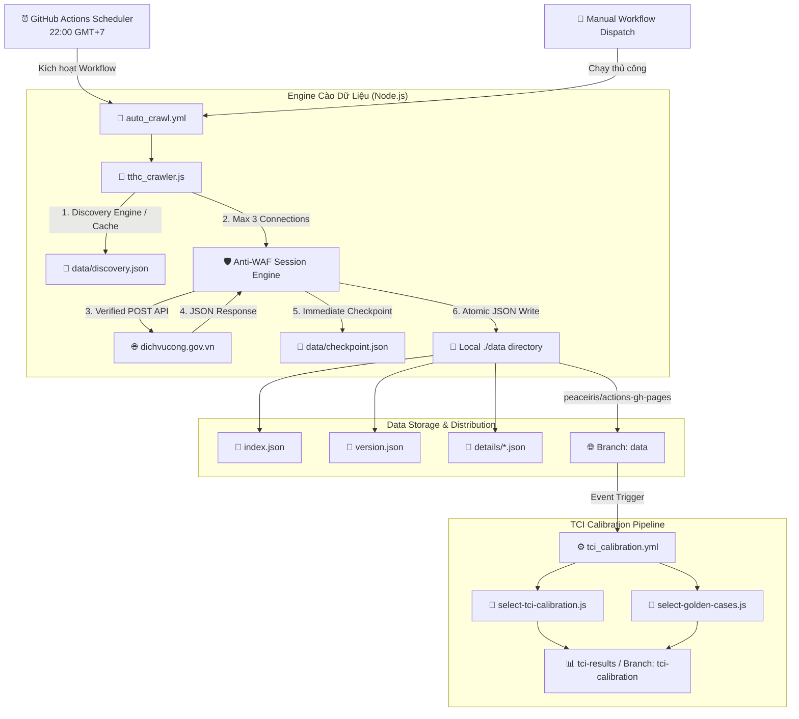
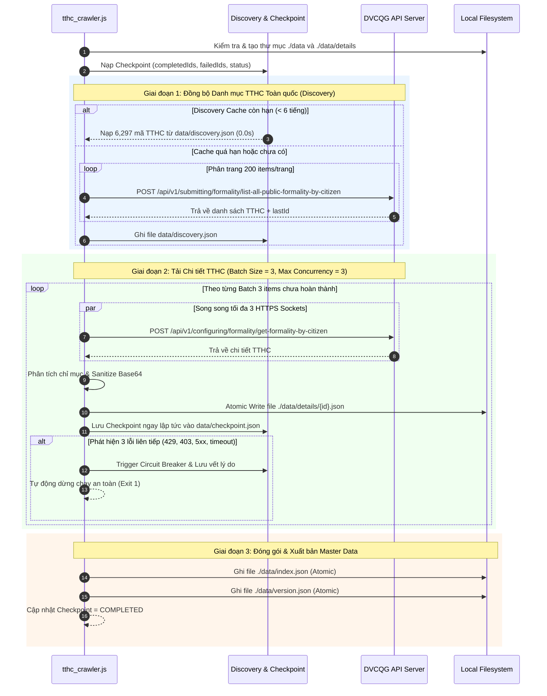

# 🚀 Crawler TTHC - Cổng Dịch vụ công Quốc gia (DVCQG)

> Hệ thống tự động thu thập, xử lý và xuất bản Master Data Thủ tục Hành chính (TTHC) toàn quốc từ Cổng Dịch vụ công Quốc gia (`dichvucong.gov.vn`).

---

## 📌 Tổng quan dự án

Dự án cung cấp giải pháp cào dữ liệu quy mô lớn (> 6,000+ TTHC) với hiệu năng cao, cơ chế vượt tường lửa (Anti-WAF/Anti-Bot) tiên tiến, và quy trình CI/CD chạy hoàn toàn tự động trên GitHub Actions.

### ✨ Nguyên tắc Thiết kế & Tính năng Nổi bật
- **⚡ Controlled Concurrency (Tối đa 3 kết nối song song):** Giới hạn tối đa 3 kết nối HTTPS socket đồng thời (`maxSockets: 3`), hoàn toàn loại bỏ nguy cơ nghẽn kết nối hay bị tường lửa tarpit/drop kết nối.
- **🛡️ Conservative Rate & Jitter:** Sử dụng delay cơ sở (300ms) kết hợp nhiễu ngẫu nhiên (Jitter 0-200ms) giữa các đợt request để giữ tải ở mức lịch sự và tự nhiên.
- **⚡ Discovery Caching:** Tự động lưu cache danh mục toàn quốc vào `data/discovery.json`. Các lần chạy tiếp theo (< 6 tiếng) sẽ khởi động tức thì mà không cần quét lại 32 trang API danh mục.
- **⚡ Immediate Checkpointing:** Lưu tiến độ ngay lập tức vào `data/checkpoint.json` sau mỗi item. Khi tiến trình bị gián đoạn, hệ thống tự động tiếp tục tại item chưa tải mà không cần cào lại dữ liệu đã hoàn thành.
- **🔒 Circuit Breaker (Cầu chì an toàn):** Tự động phát hiện 3 lỗi phản hồi/tường lửa liên tiếp (429, 403, 5xx, timeout) để chủ động ngắt tiến trình an toàn và lưu vết lý do.
- **✅ Fail-Closed & Payload Verification:** Xác minh nghiêm ngặt cấu trúc phản hồi `res.data.code === 'OK'` thay vì tin tưởng mù quáng vào HTTP 200/201.
- **🛡️ Atomic JSON Writes & Graceful Teardown:** Sử dụng cơ chế ghi file nguyên tử (`safeWriteJson`) qua file tạm `.tmp` và bắt sự kiện ngắt đột ngột (`SIGINT`, `SIGTERM`) để chống hỏng file JSON khi bị ngắt.
- **📦 Xuất bản Dữ liệu Tối ưu:** Dữ liệu tự động đẩy ra nhánh `data` riêng biệt với cờ `--force-orphan`, giữ cho repository gốc luôn gọn nhẹ.

---

## 🏗️ Kiến trúc Hệ thống & Luồng Dữ liệu

### 1. Kiến trúc Tổng quan (System Architecture)



---

### 2. Luồng Xử lý Chi tiết (Data Crawling Sequence)



---

## 📁 Cấu trúc Thư mục Dự án

```text
Crawler-TTHC/
├── .github/
│   └── workflows/
│       ├── auto_crawl.yml          # Workflow chạy cào dữ liệu tự động 22:00 hàng ngày
│       └── tci_calibration.yml     # Workflow phân tích mẫu hiệu chỉnh TCI
├── data/                           # Thư mục chứa dữ liệu đầu ra (Deploy sang nhánh 'data')
│   ├── index.json                  # File chỉ mục toàn bộ TTHC
│   ├── version.json                # Thông tin phiên bản & thời gian cập nhật
│   ├── discovery.json              # File cache danh mục TTHC toàn quốc (< 6h)
│   ├── checkpoint.json             # File lưu vết tiến độ & trạng thái Circuit Breaker
│   └── details/                    # Thư mục chứa chi tiết từng TTHC dạng JSON
│       ├── 01a0a85c-80c6-768f...json
│       └── ...
├── tci/
│   ├── select-tci-calibration.js   # Script phân tích chọn 50 mẫu calibration
│   └── select-golden-cases.js      # Script trích xuất 15 mẫu Golden Cases
├── package.json                    # Khai báo dependency (axios, dotenv)
├── tthc_crawler.js                 # Engine cào dữ liệu chính (Enterprise Standard)
└── README.md                       # Tài liệu hướng dẫn hệ thống
```

---

## 🛠️ Hướng dẫn Sử dụng

### 1. Yêu cầu Môi trường
- **Node.js**: phiên bản `>= 18.0.0`
- **npm**: phiên bản `>= 9.0.0`

### 2. Cài đặt Dependency
```bash
npm install
```

### 3. Chạy cào dữ liệu thủ công tại máy cục bộ (Local Run)
```bash
node tthc_crawler.js
```
*Dữ liệu cào được và checkpoint sẽ tự động cập nhật tại thư mục `./data`.*

### 4. Chạy phân tích TCI Calibration
```bash
node tci/select-tci-calibration.js
node tci/select-golden-cases.js
```

---

## 📊 Cấu trúc Dữ liệu Đầu ra (Output Specification)

### 1. `data/index.json`
Chứa bảng chỉ mục rút gọn của toàn bộ TTHC:
```json
[
  {
    "id": "01a0a85c-80c6-768f-b7b9-e04942933ace",
    "ma_tthc": "5.003882",
    "ten_tthc": "Xây dựng kế hoạch xử lý, cải tạo và phục hồi ô nhiễm môi trường...",
    "cap_thuc_hien": "Cấp tỉnh",
    "loai_tthc": "TTHC Tiêu chuẩn",
    "linh_vuc": "Môi trường",
    "co_quan_thuc_hien": "Cơ quan chuyên môn về nông nghiệp và môi trường thuộc UBND cấp tỉnh"
  }
]
```

### 2. `data/version.json`
Chứa thông tin metadata của đợt quét:
```json
{
  "last_updated": "2026-09-17T15:30:00.000Z",
  "total_records": 6297,
  "completed_records": 6297,
  "failed_records": 0,
  "circuit_breaker_status": "COMPLETED"
}
```

### 3. `data/checkpoint.json`
Chứa bảng lưu vết trạng thái chi tiết từng item và cầu chì an toàn:
```json
{
  "completedIds": {
    "01a0a85c-80c6-768f-b7b9-e04942933ace": {
      "code": "5.003882",
      "timestamp": "2026-09-17T20:20:00.000Z",
      "verified": true
    }
  },
  "failedIds": {},
  "consecutiveFailures": 0,
  "lastUpdated": "2026-09-17T20:20:00.000Z",
  "status": "COMPLETED",
  "circuitBreakerReason": null
}
```

### 4. `data/details/{id}.json`
Chứa toàn bộ cây dữ liệu chi tiết của 1 thủ tục (đã được dọn dẹp các chuỗi mã hóa Base64 của hình ảnh đính kèm để tối ưu dung lượng).

---

## ⚙️ Cấu hình GitHub Actions

| Workflow | Trigger | Lịch / Điều kiện | Nhiệm vụ |
| :--- | :--- | :--- | :--- |
| **`auto_crawl.yml`** | `schedule` / `workflow_dispatch` | `0 15 * * *` (22:00 VN) | Chạy `tthc_crawler.js` và đẩy dữ liệu `./data` ra nhánh `data`. |
| **`tci_calibration.yml`** | `push` / `workflow_dispatch` | Khi có thay đổi code TCI / detail | Phân tích 50 mẫu calibration & 15 Golden Cases, push lên nhánh `tci-calibration`. |

---

## 🛡️ Giấy phép & Bản quyền
Dự án được duy trì bởi **Duy Nghĩa** cho mục đích nghiên cứu và thu thập dữ liệu phục vụ Dịch vụ công. Dữ liệu thuộc bản quyền công khai của Cổng Dịch vụ công Quốc gia Việt Nam.
